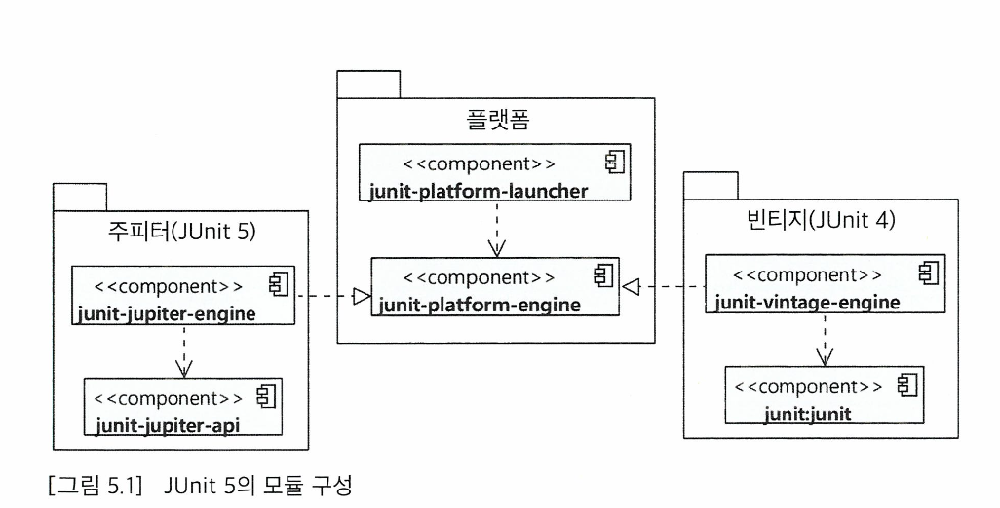

## Chapter05. JUnit 5 기초

### JUnit5 모듈 구성



- JUnit 플랫폼 : 테스팅 프레임워크를 구동하기 위한 런처와 테스트 엔진을 위한 API를 제공한다.
- JUnit 주피터: JUnit5를 위한 테스트 API와 실행 엔진을 제공한다.
- JUnit 빈티지 : JUnit3과 4로 작성된 테스트를 JUnit5 플랫폼에서 실행하기 위한 모듈을 제공한다.

 JUnit5는 테스트를 위한 주피터API를 제공한다. 주피터 API를 사용해서 테스트를 작성하고 실행하려면 주피터 관련 모듈을 의존에 추가해주면 된다. 여기서 junit-jupiter 모듈은 junit-jupiter-api 모듈과 junit-jupiter-params 모듈, junit-jupiter-engine 모듈을 포함한다. 

```xml
<dependencies> 
    <dependency>
        <groupId>org.junit.jupiter</groupld> 
        <artifactld>junit-jupiter</artifactld> 
        <version>5.5.0</version>
        <scope>test</scope> 
    </dependency>
</dependencies> 
```

```java
dependencies {
    testImplementation('org.junit.jupiter:juint-jupiter:5.5.0')
}
```

Gradel 4.6버전부터 JUnit5를 지원하고 있다. junit-jupiter 모듈은 JUnit 5.4 버전을 제공한다. 

### @Test 어노테이션과 테스트 메서드

JUnit 코드의 기본 구조는 테스트로 사용할 클래스를 만들고 @Test 어노테이션을 메서드에 붙이기만 하면 된다. 이때 @Test 어노테이션을 붙인 메서드는 private이면 안된다.

```java
public class SumTest {
     @Test
        void sum() {
            int result = 2 + 3;
            assertEquals(5, result);
        }
    }
```

### 주요 단언 메서드

JUnit의 Assertions 클래스는 assertEquals()와 같이 값을 검증하기 위한 다양한 정적 메서드를 제공한다. 

- `**assertEquals(expected, actual)**`
    
    실제 값이 기대하는 값과 같은지 검사
    
- `**assertNotEquals(expected, actual)**`
    
    실제 값이 기대하는 값과 같지 않은지 검사
    
- `**assertSame(Object expected, Object actual)**`
    
    두 객체가 동일한 객체인지 검사
    
- `**assertNotSame(Object expected, Object actual)**`
    
    두 객체가 동일하지 않은 객체인지 검사
    
- `**assertTrue(boolean condition)**`
    
    값이 true인지 검사
    
- `**assertFalse(boolean condition)**`
    
    값이 false인지 검사
    
- `**assertNull(Object actual)**`
    
    값이 null인지 검사
    
- `**assertNotNull(Object actual)**`
    
    값이 null이 아닌지 검사
    
- `**fail()**`
    
    테스트를 실패 처리
    

fail()메서드는 테스트에 실패했음을 알리고 싶을 때 사용하는데 아래 테스트 코드에서 null을 전달했는데 익셉션이 발생하지 않으면 테스트에 실패했다고 보아 fail()을 사용할 수 있다. 

```java
try {
    AuthService authService = new AuthService();
    authService.authenticate(null, null);
    fail();
} catch(IllegalArgumentException e) { }
```

익셉션 발생 유무가 검증대상이라면 fail()보다는 아래의 메서드를 사용하는 것이 더욱 더 명시적이다.

- `**assertThrow(Class<T> expectedType, Executable executable)**`
    
    executable을 실행한 결과로 지정한 타입의 익셉션이 발생하는지 검사
    
- `**assertDoesNotThrow(Executable executable)**`
    
    executable을 실행한 결과로 익셉션이 발생하지 않는지 검사
    

assertThrows()메서드는 발생한 익셉션 객체를 리턴한다. 발생한 익셉션을 이용해서 추가적으로 검증이 필요하면 assertThorws()가 리턴한 익셉션 객체를 사용하면 된다. 

```java
IllegalArgumentException thrown = assert Throws IllegalArgumentException.class, 
    () -> {
        AuthService authService = new AuthService();
        authService.authenticate(null, null); 
    });
assertTrue(thrown.getMessage().contains("id"));    
```

assert 메서드는 실패하면 다음 코드를 실행하지 않고 바로 익셉션으 ㄹ발생시킨다. 따라서 아래 코드에서 첫 번째 코드에서 검증이 실패하면 그 시점에 AssertionFailedError를 발생시키고 다음 코드는 실행되지 않는다. 

```java
assertEquals(3, 5 / 2); // 검증 실패
assertEquals(4, 2 * 2); // 실행 X
```

하지만 모든 검증을 실행하고 그 중 실패한 것이 있는지 확인하고 싶을 때가 있는데 이럴 때는 assertAll()을 사용할 수 있다. 

assertAll()은 Executable 목록을 가변인자로 받아 각각을 실행하고 실행 결과로 실패한 코드가 있으면 그 목록을 모아서 에러 메서지로 보여준다.

```java
assertAll(
    () -> assertEquals(3, 5 / 2), 
    () -> assertEquals(4, 2 * 2), 
    () -> assertEquals(6, 11 / 2)
);
```

### 테스트 라이프 사이클

JUnit의 테스트 실행 순서는 다음과 같다.

1. 테스트 메서드를 포함한 객체 생성
2. (존재하면)@BeforeEach가 붙은 메서드 실행
3. @Test가 붙은 메서드 실행
4. (존재하면)@AfterEach가 붙은 메서드 실행

그렇다면 @BeforeEach, @AfterEach가 무엇일까?

@BeforeEach는 테스트를 실행하는데 필요한 사전 준비 작업을 할 때 사용한다. 테스트에서 사용할 임시 파일이나 테스트 메서드에서 사용할 객체를 사용한다. 

 @AfterEach는 테스트 실행 후에 정리해야할 것 이 있을 때 사용한다. 테스트에서 사용한 임시 파일을 삭제해야할 경우에 사용할 수 있다. 

두 메서드는 모두 private이면 안된다.

추가적으로 @BeforeAll, @AfterAll에 대해서도 알아보자.

@BeforeAll은 한 클래스의 모든 테스트 메서드가 실행되기 전에 특정 작업을 수행해야하는 경우에 사용할 수 있다. 해당 어노테이션은 정적 메서드에 붙이는데 클래스의 모든 테스트 메서드를 실행하기전에 한번 실행된다.

 @AfterEach는 반대로 모든 테스트 메서드를 실행한 뒤에 실행되며 정적 메서드에 적용한다. 

### 테스트 메서드 간 실행 순서 의존과 필드 공유하지 않기

각 테스트 메서드는 서로 독립적으로 동작해야한다. 테스트 메서드의 결과에 따라 다른 테스트 메서드의 실행 결과가 달라지면 안된다. 따라서 테스트 메서드가 서로 필드를 공유하거나 실행 순서를 가정하고 테스트를 작성해서는 안된다 !

### 추가 어노테이션 : @DisplayName, @Disabled

@DisplayName 어노테이션을 사용해서 테스트에 표시 이름을 붙일 수 있다. 

```java
@Test
    @DisplayName("모든 규칙은 만족하는 경우")
    void meetsAllCriteria_Then_Stong() {
        assertStrength("ab12!@AB", PasswordStrength.STRONG);
        assertStrength("abc!Adasa", PasswordStrength.NORMAL);
    }
```

또한 특정 테스트를 실행하고 싶지 않을 때는 @Disabled 어노테이션을 사용한다. JUnit은 @Disabled가 붙은 클래스나 메서드는 테스트 실행 대상에서 제외한다. 

```java
@Disabled
@Test
void failMethod() {
    try {
        AuthService authService = new AuthService();
        authService.authenticate(null, null);
        fail();
    } catch(IllegalArgumentException e) { }
}
```

### 모든 테스트 실행하기

모든 테스트를 실행하는 방법은 매우 간단하다.

- mvn test (래퍼를 사용하는 경우 mvnw test)
- gradle test (래퍼를 사용하는 경우 gradlew test)

인텔리제이나 이클립스에서는 우리가 아는 대로 테스트를 실행하면 된다 .
