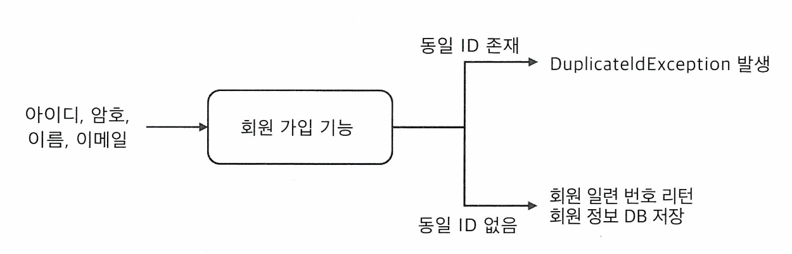
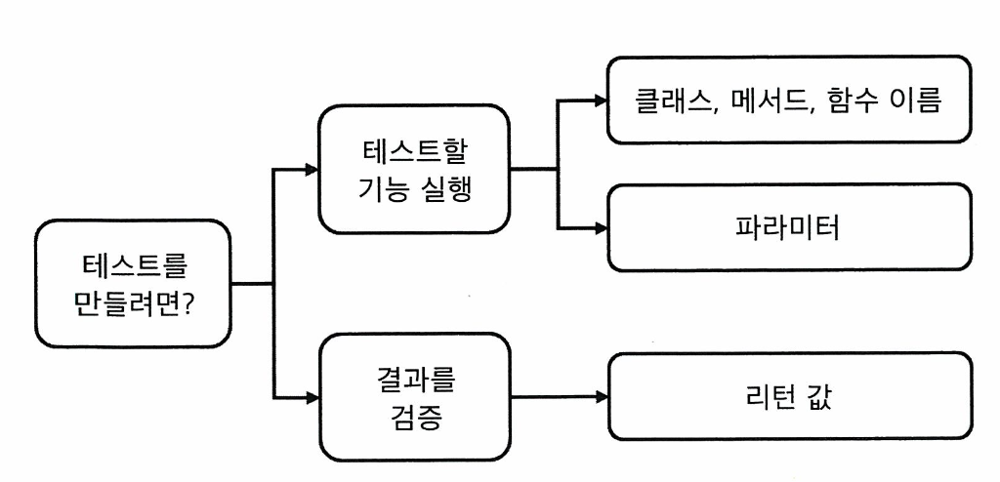

# [TDD, 기능 명세, 설계]
## 기능 명세
코드를 작성하는 이유는, 사용자에게 기능을 제공하기 위함이다.
 
기능은 크게 두 가지로 나누어 볼 수 있다.
- 입력: 메소드의 인자로 전달
- 결과: 메소드의 리턴 값 또는 **예외**, **변경**

익셉션 또한 결과가 될 수 있다는 것을 기억하자. 
회원가입 기능은 상황에 따라 익셉션 또는 값을 반환한다.  

[회원가입 기능]
- 입력: 아이디, 암호, 이름, 이메일
- 결과: 
  - 동일 아이디가 존재하는 경우: `DuplicateUserIdException`
  - 성공: 회원 번호 반환, 회원 정보 DB에 저장

기능 명세는 구체화하는 동안 입력과 결과를 도출하고, 구체화한 명세는 코드에 반영한다. 
기능 명세를 코드에 반영하는 과정에서 기능의 명칭, 파라미터, 리턴 타입이 결정된다.

## 설계 과정에서의 TDD
테스트코드를 작성하기 위해 필요한 것
- 테스트 할 기능 실행
- 실행 결과 검증

테스트 코드 작성은 먼저 이루어 져야 하지만, 결국 테스트를 통과하는 데에 사용될 객체는 정상적으로 구현되어야 한다. 
실행할 객체가 존재하려면 클래스가 있어야 하고, 클래스를 정의하기 위해서는 메소드와 파라미터 타입 등에 대해 정해야 한다. 
이는 앞서 설명한 **기능 명세**와 관련된다.

[테스트 작성 흐름] 
테스트를 작성하기 위해 필요한 것들을 흐름으로 도식화한 것이다. 
1. 클래스 이름
   메소드 이름은 협업 차원에서 다른 사람이 코드를 쉽게 이해할 수 있도록 가독성과 직관성을 고려하여 정하는 것이 좋다. 
   암호 강도 계산에서 이름을 선택했던 것처럼 'Level', 'Strength'와 같은 단어 중에서 어떤 것을 선택하는지 고민하는 시간을 갖는 것도 좋을 것 같다. 
    
2. 테스트에서 호출할 메소드 이름
   메소드 이름 역시 가독성, 직관성을 고려하여 선택한다. 
   앞선 실습에서는 암호 강도를 측정하는 메소드는 'meter'로 정의했었다. 
    
3. 메소드 파라미터
   암호는 문자열이므로, 입력 파라미터의 타입은 String으로 정하였다. 
   같은 맥락으로 사용되는 변수들의 특성을 고려하여 타입을 지정해주는 것이 좋다. 
    
4. 실행 결과
   리턴 값은 메소드 외부에서 사용되는 값이므로, 역시 리턴 값의 의미를 고려해주는 것이 좋다. 
   암호 강도 측정 실습에서 `meter` 메소드는 암호의 강도를 측정하여 반환하는데, 
   강도를 정수나 문자열로 반환하는 것보다 `enum` 값으로 반환하는 것이 앞으로의 변경 사항에 대응하기 좋다고 판단하여 `enum`을 반환한다. 

위에서 명시한 네 가지를 결정하는 것이 기능의 설계이다. 
TDD 과정에서 고민하는 것들이 기능 설계를 위해 고민하는 것들과 일치하기 때문에, 
TDD를 통해 기능 설계를 하면서 구현을 진행할 수 있다.

### 필요한 만큼 설계
TDD는 테스트를 통과할 만큼의 코드만 작성한다. 
미리 이런 기능이나 예외가 필요할 것이라고 예상해서 작성하지 않는다. 
테스트 케이스를 추가하고, 통과시키는 과정에서 요구되는 만큼만 설계를 변경한다.  
- 예를 들어, 중복된 아이디가 있어 회원가입에 실패했을 때 비로소 `DuplicateUserIdException`이 필요하다고 판단되면, 
  그 때 `DuplicateUserIdException`을 정의하고, 테스트 코드를 작성한다. 

TDD를 통해 기능 설계의 일부를 진행하게 되지만, 요구분석 과정에서 기능 설계는 여전히 필수적이다. 
처음 설계한 기능 설계가 변경되면서 불필요하던게 요구되거나, 필요하던게 불필요해질 수도 있다. 
T**DD는 동적인 기능 설계에 대해 필요한 만큼만 재설계를 진행하며 코드에 반영할 수 있도록 한다.**

## 기능 명세 구체화
개발자는 보통 기획자로부터 스토리보드, 와이어프레임으로 기능 명세를 전달 받는다. 
그러나 스토리보드나 와이어프레임으로부터는 입력, 결과, 파라미터 타입 등이 바로 도출되지 않는다. 
따라서 개발자가 기능을 구현할 수 있을 정도로 기능 명세를 구체화해야 한다. 
 
기능 명세를 구체화 하기 위해 개발자는 예시를 들어 기획자와 소통한다. 
이 때 드는 예시가 테스트 케이스에 해당한다고 볼 수 있다. 
요구사항만 보면 불명확한 기능을 예시를 통해 구체화하면서 요구사항을 더 잘 이해하는데, 
이는 **TDD에서 테스트 케이스를 먼저 거친 후 올바르게 동작하는 기능을 구현하는 것과 같다.**
