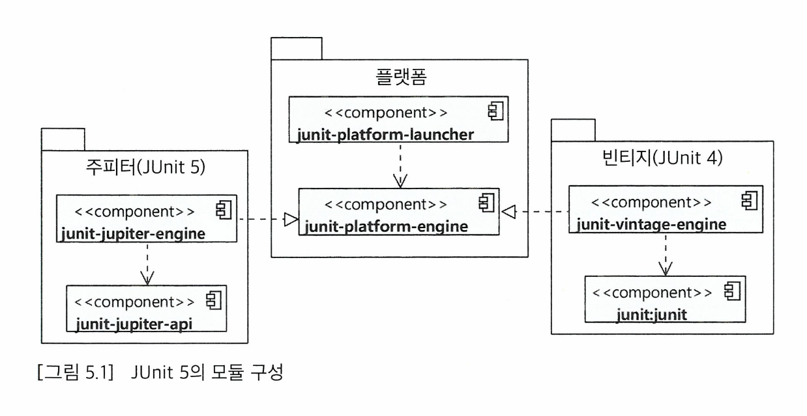

# [JUnit 5 기초]
## JUnit5 모듈 구성
JUnit5의 구성 요소는 다음 3가지이다.
- JUnit Platform: 테스팅 프레임워크 구동을 위한 런처, 테스트 엔진을 위한 API 제공
- JUnit Jupiter: JUnit5를 위한 테스트 API 및 테스트 엔진 구현
- JUnit Vintage: 레거시 JUnit3, JUnit4를 위한 테스트 엔진 구현


JUnit 5는 테스트 API로 Jupiter를 사용한다.<br>
Jupiter API는 `junit-jupiter` 모듈을 의존성에 추가하여 사용할 수 있으며,<br>
`junit-jupiter`는 `junit-jupiter-api`와 `junit-jupiter-params`, `junit-jupiter-engine`로 구성된다.<br>

gradle의 경우, `build.gralde`에 Junit을 사용하는 statement를 추가한다.
```gradle
test {
    useJUnitPlatform()
    ...
}
```

## @Test 어노테이션과 테스트 메소드
JUnit 코드의 기본 구조는, 테스트 클래스를 선언하고 테스트를 수행하는 메소드에 @Test 어노테이션을 붙이는 것이다.<br>
테스트 클래스의 이름은 보통 마지막에 Test를 붙이는 것이 일반적이다.<br>
테스트 메소드는 private이 아니고, void이고, 파라미터가 없는 메소드여야 한다.

JUnit의 Assertions 클래스는 값을 검증하기 위한 다양한 assert static method를 지원한다.<br>
결과 값이 일치하는지 확인하는 `assertEquals`, 특정 에러가 발생하는지 확인하는 `assertThrows` 등이 있다.<br>

## 주요 단언 메소드

| 메소드 | 설명                         |
|---|----------------------------|
| assertEquals(expected, actual) | 두 값이 일치하는지 확인              |
| assertArrayEquals(expected, actual) | 두 배열이 일치하는지 확인             |
| assertNotEquals(unexpected, actual) | 두 값이 일치하지 않는지 확인           |
| assertTrue(boolean) | 조건이 참인지 확인                 |
| assertFalse(boolean) | 조건이 거짓인지 확인                |
| assertNull(object) | 값이 null인지 확인               |
| assertNotNull(object) | 값이 null이 아닌지 확인            |
| assertSame(expected, actual) | 두 객체가 같은 객체인지 확인           |
| assertNotSame(unexpected, actual) | 두 객체가 다른 객체인지 확인           |
| assertThrows(expectedType, executable) | 예외가 발생하는지 확인               |
| assertTimeout(duration, executable) | 실행 시간이 duration 안에 끝나는지 확인 |
| fail() | 테스트를 실패 처리                 |

단언 메소드들은 주로 타입 별로 메소드가 오버로딩 되어 있다.<br>
`fail` 메소드는 예외가 발생하는 테스트 케이스 실행 시, 터져야 하는 에러가 터지지 않으면 `fail`을 호출하여 실패 처리를 할 수도 있다.<br>
```java
try {
    AuthService authService = new AuthService();
    authService.authenticate(null, null);
    fail("예외가 발생해야 합니다.");
} catch (Exception e) {
    e.printStackTrace();
}
```
그러나 개인적으로 assertThrows를 사용하는 것이 더 깔끔하다고 생각한다.<br>
예외를 터뜨리는 테스트 케이스에 대한 단언 메소드는 아래와 같다.

| 메소드 | 설명                         |
|---|----------------------------|
| assertThrows(expectedType, executable) | 예외가 발생하는지 확인               |
| assertDoesNotThrow(executable) | 예외가 발생하지 않는지 확인           |

[assertThrows 예제]
```java
assertThrows(IllegalArgumentException.class, () -> {
    AuthService authService = new AuthService();
    authService.authenticate(null, null);
});

// OR

IllegalArgumentException thrown = assertThrows(IllegalArgumentException.class, () -> {
    AuthService authService = new AuthService();
    authService.authenticate(null, null);
});
assertTrue(thrown.getMessage().contains("username"));
```

본래 assert문은 실패 시 에러를 반환하며, 그 이후에 등장하는 코드들은 실행되지 않는다.<br>
그러나 assertAll 메소드를 사용하면 모든 단언을 실행하고 결과를 반환한다.<br>
```java
assertAll(
    () -> assertEquals(1, 2),
    () -> assertEquals(2, 2),
    () -> assertEquals(3, 2)
);
```
`assertAll` 메소드는 인자로 `Executable` 목록을 받아 각 인자를 실행한다.<br>
실행 결과로 실패한 단언이 있으면 그 목록을 모아서 에러 메세지로 보여준다.<br>


## 라이프사이클
### @BeforeEach, @AfterEach
테스트 메소드 실행 전, 후에 실행되는 메소드를 정의할 수 있다.<br>
`@BeforeEach` 어노테이션은 테스트 메소드 실행 전에 실행되는 메소드를 정의할 때 사용한다. (setUp)<br>
`@AfterEach` 어노테이션은 테스트 메소드 실행 후에 실행되는 메소드를 정의할 때 사용한다. (tearDown)<br>

즉 각 테스트 메소드는 다음과 같은 순서로 실행된다.
1. 테스트 메서드를 포함하는 객체 생성
2. `@BeforeEach` 메소드 실행
3. 테스트 메소드 실행
4. `@AfterEach` 메소드 실행

```java
public class LifeCycleTest {
    
        @BeforeEach
        void setUp() {
            System.out.println("setUp");
        }
    
        @Test
        void test1() {
            System.out.println("test1");
        }
    
        @Test
        void test2() {
            System.out.println("test2");
        }
    
        @AfterEach
        void tearDown() {
            System.out.println("tearDown");
        }
}
```

```text
//실행 결과
setUp
test1
tearDown
setUp
test2
tearDown
```

위와 같이 각 테스트 메소드에 대해 실행 전에 @BeforeEach 메소드가 실행되고, 실행 후에 @AfterEach 메소드가 실행된다.<br>
@BeforeEach는 주로 테스트에서 사용할 임시 파일이나 객체를 생성하는 데에 사용되고,<br>
@AfterEach는 주로 테스트에서 사용한 임시 파일이나 객체를 삭제하는 데에 사용된다.<br>
`@BeforeEach`와 `@AfterEach` 메소드는 상속되지 않는다.<br>

### @BeforeAll, @AfterAll
`@BeforeAll` 어노테이션은 테스트 클래스의 모든 테스트 메소드 실행 전에 실행되는 메소드를 정의할 때 사용한다.<br>
`@AfterAll` 어노테이션은 테스트 클래스의 모든 테스트 메소드 실행 후에 실행되는 메소드를 정의할 때 사용한다.<br>

### 테스트 메소드 간 실행 순서 의존 / 필드 공유 금지
JUnit은 테스트 메소드 간 실행 순서가 보장되지 않는다.<br>
따라서 테스트 메소드 간 실행 순서에 의존하는 테스트 코드를 작성하면 안된다.<br>
각 테스트 메소드는 독립적으로 작용해야 한다.<br>

따라서 테스트 메소드 간 필드를 공유하면 안된다.<br>
공유 필드 상태에 변경이 생기면, 그 후에 실행되는 테스트 메소드가 영향을 받으므로 의존적이게 되기 때문이다.<br>
테스트 메소드 간 필드를 공유해야 하는 경우에는 `@BeforeEach` 메소드에서 초기화하고, `@AfterEach` 메소드에서 정리하는 방식으로 사용해야 한다.<br>

### 추가 어노테이션: @DisplayName, @Disabled
`@DisplayName` 어노테이션은 테스트 클래스나 메소드의 이름을 지정할 때 사용한다.<br>
테스트 실행 결과에서 나타내고 싶은 간략한 설명을 적는다.<br>

`@Disabled` 어노테이션은 테스트 메소드를 비활성화할 때 사용한다.<br>
아직 구현되지 않은 테스트 메소드나 테스트 메소드를 임시로 비활성화할 때 사용한다.<br>

### 모든 테스트 실행하기
단일 클래스의 메소드들만 테스트하지 않고, 모든 테스트를 실행하는 방법이 있다.
```shell
mvn test // wrapper 사용 시 `mvnw test`
gradle test // wrapper 사용 시 `gradlew test`
```

위의 실행 결과로 실행한 테스트의 개수, 성공 개수, 실패 개수 등이 출력된다.