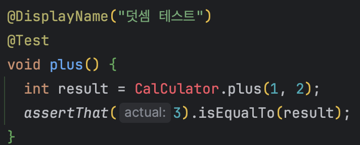
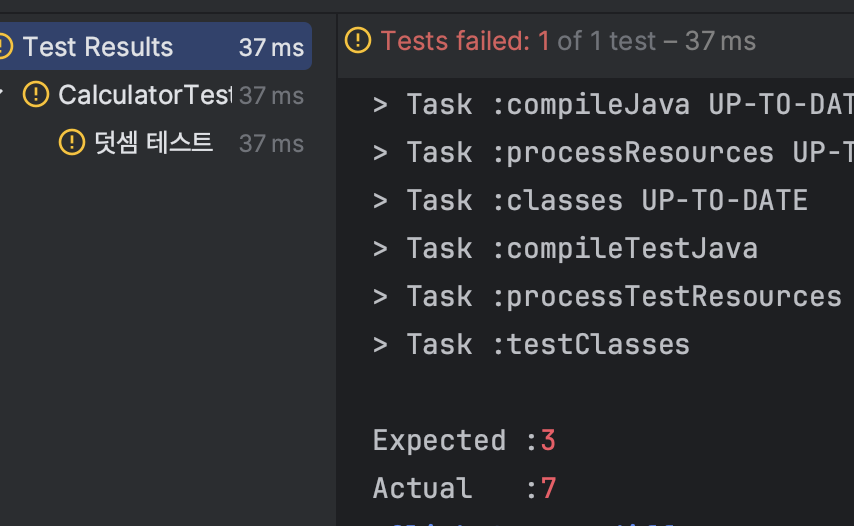
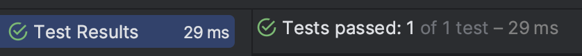

# Week02

[테스트 주도 개발 시작하기](https://product.kyobobook.co.kr/detail/S000001248962) 2장 정리

## 기존의 개발 방식

1. 설계 - 도출할 클래스와 인터페이스, 타입에 넣을 메서드를 고민
2. 구현 코드를 한번에 작성
3. 구현 완료 후 테스트
4. 의도한 대로 동작하지 않거나 문제 발생 시 2에서 작성한 코드를 디버깅, 원인 탐색
5. 반복

### 단점

1. 코드가 많아질 경우 디버깅 하는 시간도 길어진다. 원인 찾기가 힘들다.
2. 코드 작성 개발자와 테스트 하는 개발자가 다른 경우
3. 테스트 과정이 어려움

## TDD란?

위의 과정과 다르게 TDD는 테스트를 먼저한다. TDD는 기능을 검증하는 테스트 코드를 먼저 작성하고, 테스트를 통과시키기 위해 해당 테스트를 위한 기능을 구현하는 방식이다.

### TDD 코드 위치

1. 먼저 src/test/java에 작성 (해당 위치는 배포 대상이 아님)
2. 개발 완료 후 배포 대상 위치인 src/main/java로 이동

### TDD 과정

아래는 TDD의 흐름이다.

1. 기능을 검증하는 테스트를 작성
2. 테스트 코드를 통과할 만큼만 코드를 작성
3. 개선할 코드가 있으면 리팩토링

위 과정을 반복하며 점진적으로 기능을 완성한다.

### 예제

우선 더하기 기능을 구현한다고 가정하고 이에 대한 test 코드를 먼저 작성한다.

이 과정에서 메서드 이름, 파라미터, 메서드의 타입(정적 or 인스턴스), 클래스 이름 등을 고민한다.

```java
public class CalculatorTest {

    @DisplayName("덧셈 테스트")
    @Test
    void plus() {
        int result = CalCulator.plus(1, 2);
        assertThat(3).isEqualTo(result);
    }
}
// assertThat은 static org.assertj.core.api.Assertions.*; 를 import
```

그러면 아직은 아래와 같은 에러가 난다. Calculator 클래스가 존재하지 않기 때문이다.


그러면 컴파일 오류로 테스트 코드가 실패하므로  src/test/java에 CalCulator 클래스와 메소드를 작성해준다.

여기서 test 코드를 통과할 수 있도록 작성한다.

```java
public class Calculator {
  public static int plus(int n1, int n2) {
    return 3;
  }
}
```

그 다음 덧셈 검증 코드를 하나 더 추가한다. 3 + 4를 검증하는 코드 하나를 추가했다.

```java
public class CalculatorTest {

    @DisplayName("덧셈 테스트")
    @Test
    void plus() {
			int result = Calculator.plus(1, 2);
	    int result2 = Calculator.plus(3, 4);

	    assertThat(3).isEqualTo(result);
	    assertThat(3).isEqualTo(result2);
    }
}
```

해당 테스트는 당연히 실패한다. 우리는 이 테스트 코드가 통과될 수 있도록 수정해야한다.


추가된 경우의 수가 통과될 수 있도록 아래와 같이 코드를 수정한다.

```java
public class Calculator {
  public static int plus(int n1, int n2) {
    return n1 + n2;
  }
}
```

그러면 아래와 같이 test가 통과한다.


이제 테스트가 완료했으니, `[Calculator.java](http://Calculator.java)` 를 src/main/java로 이동시킨다. 이동 후 한번 더 CalculatorTest를 작동시켜 검증한다.

위의 과정과 같이 TDD는 테스트 코드 중심으로 이루어진다. 테스트 코드를 작성한 후, 그 테스트 코드가 통과할 수 있도록 기능을 구현하는 것이다. 또한 경우의 수를 추가하면서 기능을 점진적으로 완성할 수 있다. 한 테스트 완료 후에는 리팩토링을 진행하여 코드를 깔끔하게 다듬는다.

### TDD 사이클

<aside>
♻️ **레드(Red) - 그린(Green) - 리팩터(Refactor)**

</aside>

- 레드(Red) : 실패하는 테스트
- 그린(Green) : 성공하는 테스트
- 리팩터(Refactor) : 리팩토링

### 특징

<aside>
📃 **테스트가 개발을 주도**

</aside>

- 테스트 코드 구현 시 다음 개발 범위가 정해진다.
- 코드가 추가되며 범위가 확장될 수록 구현이 완성되어 간다.

<aside>
📃 **지속적인 코드 정리**

</aside>

- 기능을 검증해주는 테스트 코드가 있으면 리팩토링에 대한 불안감을 줄일 수 있다.
- 개발 과정에서 지속적으로 코드를 정리하므로 코드 품질을 보장할 수 있다.

<aside>
📃 **빠른 피드백**

</aside>

- 코드 수정에 따른 피드백이 빠르다.
- 코드에 변화가 생기면 테스트 코드를 실행하여 해당 코드가 올바른지 바로 확인이 가능하다.
