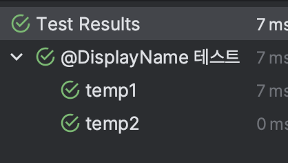

> 책이 출간된 시점에서 Junit 5는 5.5가 최신버전이다. 책은 5.5를 기준으로 설명한다.
>

Junit 5는 주피터 API를 사용하므로 주피터 관련 모듈을 의존에 추가하면 된다.

책에서는 다른데 이제 이렇게만 추가해주면 사용 가능한 것 같다.

```java
    testImplementation 'org.springframework.boot:spring-boot-starter-test'

```

## JUnit5 사용 절차

1. 테스트 클래스 만들기
2. 테스트 메소드 생성
3. 메소드에 @Test 어노테이션 붙이기 (이 때 메소드는 private이면 안된다)

```java
public class SumTest {

	@Test
	void sum(){
		int result = 2 + 3;
		assertEquals(5, result);
	}
}
```

## 주요 단언메소드

전체적인 단언메소드로는 아래와 같은 메소드 등이 있다.

| 메소드 | 설명 |
| --- | --- |
| assertEquals(expected, actual) | expected와 actual이 같은지 검사  |
| assertNotEquals(unexpected, actual)  | expected와 actual이 같지 않은지 검사 |
| assertSame(Object expected, Object actual) | 두 객체가 동일한 객체인지 검사 |
| assertNotSame(Object unexpected, Object actual) | 두 객체가 다른 객체인지 검사 |
|  assertTrue(boolean condition) | 조건이 참인지 검사 |
| assertFalse(boolean condition) | 조건이 거짓인지 검사 |
| assertNull(Object actual) | 값이 null인지 검사 |
| assertNotNull(Object actual) | 값이 null이 아닌지 검사 |
| assertArrayEquals(expected, actual) | 두 배열이 일치하는지 검사 |
| assertThrows(class<T> expectedType, Executable executable) | executable을 실행한 결과로 지정한 예외가 발생하는지 검사 |
| assertDoesNotThrows(Executable executable) | executable을 실행한 결과로 지정한 예외가 발생하지 않는지 검사 |
| assertTimeout(duration, executable) |  실행 시간이 duration 안에 끝나는지 검사 |
|  fail()  | 테스트를 실패 처리    |
|  |  |

### assertEquals()

assertEquals()메서드는 주요 타입별로 존재한다. int, Long, Object 등등 다양한 타입을 지원한다. 첫 번째 인자가 기대하는 값, 두 번째 인자가 검사하고자 하는 값이다.

assertEquals(Object expected, Object actual) 메서드는 객체를 비교할 수 있다. 예를 들어 LocalDate 클래스를 비교할 수 있다.

```java
LocalDate d1 = LocalDate.now();
LocalDate d2 = LocalDate.now();
assertEquals(d1, d2);
```

### Exception 발생 유무 검사

지정한 Exception이 발생하는지 검사할 수 있는 메소드로 assertThrows와 assertDoesNotThrows가 있다.

| 메소드 | 설명 |
| --- | --- |
| assertThrows(class<T> expectedType, Executable executable) | executable을 실행한 결과로 지정한 예외가 발생하는지 검사 |
| assertDoesNotThrows(Executable executable) | executable을 실행한 결과로 지정한 예외가 발생하지 않는지 검사 |
|  |  |

**assertThrows로 지정한** Exception이 발생하는지 검사하는 코드

- 발생한 excepion 객체를 리턴하므로 이를 이용해서 추가적인 검증을 할 수 있다.

```java
IllefalArgumentException thrown = assertThrows(IllegalArgumentException.class, 
	() -> {
    AuthService authService = new AuthService();
    authService.authenticate(null, null);
});
assertTure(thrown.getMessage().contains("id"));
```

**assertThrows로 지정한** Exception이 발생하는지 검사하는 코드

### assertAll()

assert 메서드는 실패하면 다음 코드를 실행하지 않고 바로 exception을 발생한다.

```java
assertEquals(3, 5 / 2); // 실패, 바로 exception 발생
assertEquals(4, 2 * 2); // 실행되지 않음 
```

만약 모든 검증을 실행하고 싶을 경우, assertAll()를 사용하면 된다. Exeutable 목록을 가변 인자로 받아 각각 실행하며, 실패한 코드에 대해 목록을 모아서 에러 메시지를 출력한다.

```java
assertAll(
	() -> assertEquals(3, 5 / 2);
	() -> assertEquals(4, 2 * 2);
	() -> assertEquals(6, 11 / 2);

);
```

## 테스트 라이프 사이클

### @BeforeEach, @AfterEach

Junit의 실행순서는 아래와 같다.

1. 테스트 메서드를 포함한 객체 생성
2. (존재할 경우)@BeforeEach 어노테이션 붙은 메소드 실행
3. @Test 어노테이션이 붙은 메소드 실행
4. @AfterEach 어노테이션 붙은 메소드 실행

@BeforeEach

- 테스트 실행할 때 필요한 준비 작업을 할 때 사용
- ex) 임시 파일 생성, 테스트 메서드에서 사용할 객체 생성

@AfterEach

- 테스트 후 정리할 것이 있을 때 사용
- ex) 생성한 임시 파일 삭제

두 어노테이션이 붙은 메소드 역시 private이 붙으면 안된다.

### @BeforeAll, @AfterAll

@BeforeAll

- 한 클래스의 모든 테스트 메서드가 실행되기전  필요한 준비 작업을 할 때 사용
- 정적 메서드에 붙이기 때문에 딱 한 번 실행된다.

@AfterAll

- 한 클래스의 모든 테스트 메서드가 실행한 뒤 실행된다.
- 이 역시 정적 메서드에 붙이기 때문에 딱 한 번 실행된다.

### 테스트 메소드 간 실행 순서 의존과 필드 공유하지 않기

- 각 테스트 메소드는 반드시 독립적으로 동작해야한다.
- 테스트 메소드가 특정 순서대로 실행된다는 가정을 하고 메소드를 작성해서는 안된다.
- 순서는 버전에 따라 달라질 수 있으므로, 내가 가정한 순서는 언제든 섞일 가능성이 있다.
- 테스트 메소드가 서로 필드를 공유한다거나, 실행순서를 가정해서는 안된다.

## @DisplayName, @Disabled

### @DisplayName

- 테스트 결과에 설명을 부연할 수 있다.

```java
@DisplayName("@DisplayName 테스트")
public class TempTest {

  @DisplayName("temp1")
  @Test
  void temp1Method() {

  }

  @DisplayName("temp2")
  @Test
  void temp2Method() {

  }
}
```

위의 코드에 따른 테스트 결과는 다음과 같이 표시된다.



### @Disabled

- 해당 어노테이션이 붙은 메소드는 테스트 실행 대상에서 제외한다.