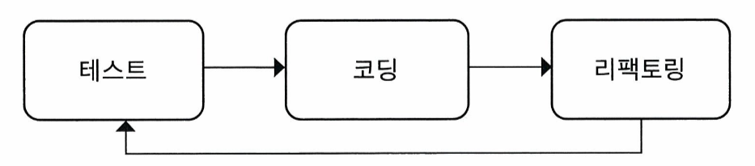

# Chapter 2. TDD 시작

## TDD 이전의 개발

일반적으로 우리가 TDD를 고려하지 않고 개발할 때는 다음과 같은 방식을 주로 사용한다.

1. 만들 기능에 대한 설계를 고민한다. (클래스와 인터페이스, 타입과 메서드)
2. **1**의 과정을 생각하며 대략적으로 어떤 식으로 코드를 구현할지 생각한다.
3. 구현을 완료했으면 테스트한다. 이때 테스트에서 오류가 일어날 시 디버깅을 통해 원인을 찾는다.

위 방식의 개발 방식을 사용할 경우 아래와 같은 문제점들을 꼽을 수 있다.

1. 디버깅을 할 때 로그 메시지, 디버거를 통해 한 줄 한 줄 따라가며 원인을 탐색한다. 이때 개발 숙련도에 다라 버그를 찾는 시간이 개발 시간보다 오래 걸리게 된다.
2. 코드 작성자와 코드 테스트자가 다를 경우 테스트에 리소스가 더 많이 들어가게 된다.
3. DB에 실제로 영향이 갈 수 있는 방식으로 테스트를 진행하게된다.

+) 오류를 해결하는 과정에서 다른 케이스에 영향을 주는 것을 모를 수도 있다.

## TDD란?

- 간단하게 말해서 '구현 후 테스트' 가 아닌 **_'테스트 작성 후 구현'_**
  - 여기서 테스트 작성은 실제 모든 테스트를 통과하게가 아닌 기능을 검증하는 테스트 코드를 먼저 작성한다는 뜻
  - 처음 작성한 테스트는 실패하는게 당연하고 이후 해당 테스트를 통과하게 점진적으로 작성해나간다.
- 테스트 코드 작성은 src/test/java 폴더 하위에서 작성한다.
  - maven, gradle 프로젝트는 해당 경로에서 진행하게 된다.
  - spring boot 프로젝트 또한(우리는 gradle을 이용하기 때문에) 해당 경로에 작성하면 된다.
  - spring boot에 처음부터 해당 폴더가 있는 것은 "Spring Boot가 테스트 중심의 개발 방식을 강력하게 지원하기 때문"이라고 GPT가 대답을 해주었지만 다시 알아보고 수정할 예정
- TDD를 위해 테스트 코드를 먼저 작성하는 동안 위의 TDD 이전의 개발에서 생각하는 부분들을 똑같이 생각할 수 있다.
  - 메소드 이름, 메소드 파라미터 개수, 타입, 반환값, 메소드 구현 방식(정적 메소드, 인스턴스 메소드), 메소드를 제공할 클래스 이름 등
  - 결국 기능을 구현하기 전 설계는 무조건 거쳐야하는 과정인데 이를 테스트를 구성하며 더 꼼꼼하게 할 수 있다고 생각한다.
- 작성한 테스트 코드에 맞게 코드를 작성해나가는데 구현이 단순하지 않을 때는 점진적으로 구현을 완성해나간다.

### 대략적인 방법

- @Test 어노테이션을 통해 메소드를 테스트 메소드(기능을 검증하는 코드를 담고 있는 메소드)로 인식시킬 수 있다.
- 책에서는 junit의 Assertions를 사용했는데 우리는 세미나에서 assertj를 사용했다.
  - junit은 `assertEquals`, `assertTrue`, `assertNotNull`과 같은 형식의 기본적인 검증 형식을 제공한다.
  - assertj는 junit보다 풍부한 검증 방식이 존재하며 `assertThat`은 자연어와 유사한 문법으로 검증 조건을 기술할 수 있다.
  - assertj가 실패시 더 상세하고 유용한 에러 메시지를 제공한다.
  - 그래서 Spring Boot에서는 Junit으로 테스트 환경을 구성하고 assertj를 통해 검증을 하는 방식을 주로 사용한다.

## 암호 검사기 예제

암호 검사기 예제를 통해 다음과 같은 내용을 알 수 있었다.

1. 첫 번째 테스트를 작성할 때는 가장 쉽거나 가장 예외적인 상황을 선택한다.
   - 기능적으로 가장 특별하지 않은 기본 상태를 바탕으로 생각하면 될 것 같다.
2. 테스트 코드를 작성할 떄는 읽기 쉽게 작성할 필요가 있다. 테스트하고싶은 내용과 결과가 더 잘 표현되도록 작성할 필요가 있다.
3. TDD는 현재 작성한 테스트를 통과시킬 만큼의 코드만 작성 후 점진적으로 테스트를 추가 작성하며 코드 구현을 완성해나간다.
4. 테스트 코드도 유지보수를 한다
   - 중복을 최소화하고 의미가 잘 드러나게 코드를 작성할 필요가 있기 때문에 유지보수를 한다.
   - 이때 무작정 중복 제거가 아닌 가독성 향상과 수정의 용이함을 생각하며 제거해야한다. ex) 인스턴스를 매번 생성하지 않고 클래스 변수로 선언해서 사용
5. 코드가 수정될 때마다 테스트를 실행하는 습관을 가져야한다.
6. 점진적으로 테스트를 통과할 수 있도록 코드를 추가한 후 리팩토링을 거쳐준다.
   - 복잡한 코드를 수정하며 리팩토링을 한 후에도 매번 테스트를 실행해야한다.

