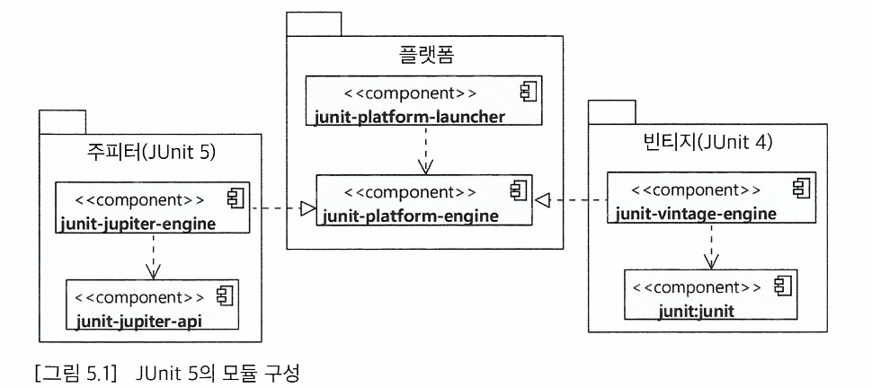

# Chapter 5. JUnit 5 기초

## Junit5모듈 구성

JUnit5는 크게 3개의 요소로 구성되어 있다.

- JUnit 플랫폼  
   테스팅 프레임워크를 구동하기 위한 런처와 테스트 엔진을 위한 API를 제공
- JUnit 주피터  
   JUnit5를 위한 테스트 API와 실행 엔진을 제공
- JUnit 빈티지  
   JUnit3과 4로 작성된 테스트를 JUnit5 플랫폼에서 실행하기 위한 모듈을 제공

## 테스트 작성 방법

### 테스트 클래스와 메소드

1. 테스트로 사용할 클래스를 만든다.  
   테스트 클래스의 이름을 작성할 때는 보통 다른 클래스와 구분하기 위해 Test를 접미사로 붙임
2. 테스트를 실행할 메소드에 @Test 어노테이션을 붙인다.  
   테스트 어노테이션을 붙인 메소드는 private면 안됨
3. 메소드 내에서 검증 메소드를 이용해 결과를 확인한다.

### 주요 단언 메소드

책에서는 JUnit의 검증 메소드를 소개해준다. assertEquals, assertSame, assertTrue, assertNull 등을 소개해주는데 우리는 assertThat을 쓰는 assertJ를 주로 사용할 것이기 때문에 따로 정리를 하지는 않았다.

익셉션 발생 유무를 검증하는 로직에서는 assertThrows를 이용할 수 있다.

assert 메소드는 실패하면 다음 코드를 실행하지 않는데 이때 모든 assert 메소드의 실행을 보장하고 싶을 때는 assertAll을 사용할 수 있다.

### 라이프사이클

JUnit은 각 테스트 메소드마다 다음 순서대로 코드를 실행한다.

1. 테스트 메소드를 포함한 객체 생성
2. (존재한다면) @BeforeEach 어노테이션이 붙은 메소드 실행
3. @Test 어노테이션이 붙은 메소드 실행
4. (존재한다면) @AfterEach 어노테이션이 붙은 메소드 실행

@Test가 어노테이션이 붙은 테스트 메소드가 두개라면 위 과정이 두 번 실행된다.

이를 이용해 테스트 전 필요한 상황을 세팅하거나 테스트 실행 후 이전 상황에 맞게 돌려두는 등의 과정을 거칠 수 있다.

@BeforeAll, @AfterAll 이라는 어노테이션들도 존재하는데 이들은 매 테스트 메소드 전 실행되는 것이 아닌 테스트 클래스에 있는 모든 테스트 메소드 실행 전 / 후에 한 번씩만 실행된다.

### 이외 유의사항

#### 테스트 메소드 간 싱행순서 의존과 필드 공유하지 않기

테스트를 작성할 때는 테스트가 특정 순서대로 실행된다는 가정 하에 테스트 메소드를 작성하면 안된다. 물론 JUnit에서는 메소드의 실행 순서를 지정할 수 있는 기능을 제공하지만 이를 기준으로 테스트를 작성할 겨우 문제가 생길 수 있다.

테스트는 서로 독립적으로 동작해야하며 서로 필드를 공유한다거나 실행 순서를 가정하고 테스트를 작성하는 등 다른 테스트에 의존하게 되면 테스트의 의미가 옅어지고 테스트 코드의 유지보수가 어려워질 수 있다.

#### 추가 어노테이션

- @DisplayName  
   테스트 메소드 명을 한글로 작성해도 되지만 그것보다는 위 어노테이션을 사용하도록 하자. @DisplayName을 사용하면 테스트에 표시되는 이름을 부여할 수 있다. 이때 이름은 코드 기준으로 표현하는 것보다 서비스적인 내용을 표시하는 것이 좋다.
- @Disabled
  해당 어노테이션이 붙은 테스트 메소드는 테스트 진행 때 실행되지 않는다. 위 어노테이션을 이용해 아직 완성하지 않은 테스트를 실행하지 않을 수 있다.
