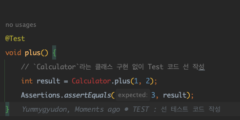

# 💊 TDD 효능
- 기능이 <u>올바르게 동작하는지 검증해야만</u> 다음 개발을 진행한다.
  - 기존 : 한 번에 작성한 **코드가 많아서 디버깅 시간이 너무 길다**.
  - 기존 : 원인을 찾기 위해 **많은 코드를 탐색 해야한다**.
  - 기존 : 최초 코드 작성 시간보다 **버그 찾는데 시간이 더 오래 걸린다.**
- 코드 수정에 대한 <u>**빠른 피드백** 가능</u>
  - 잘못된 코드가 배포되는 것 방지

# ❓TDD 란?

---
- 테스트부터 시작한다.
- <u>기능 검증 <strong>테스트 코드</u>를 먼저 작성</strong>하고 <strong><u>테스트를 통과시키기 위해 개발</u></strong>한다.

처음에는 낯설 수 있을만한 방법론이다. 
<u>어떠한 도메인 클래스 구현 없이, 어떠한 메서드 선언 없이</u> 
그냥 먼저 **우리가 설계한 의도대로 작동하는 코드**를 먼저 작성한다.

먼저 <u>구현도 안 된 클래스/메서드들에 대해 **코드를 먼저 작성**</u>하고 
해당 **테스트 코드가 돌아갈 수 있도록 구현**하는 방식인 것이다.

책에서 보여주는...끔찍하고 유도리 없는 TDD의 절차 예제에 대한...설명은 생략하겠다. 
(책이 끔찍한 것이 아닌 예시 흐름이 끔찍하다는 것..)

> 🤮 정리 Flow
1. 테스트 코드 작성
2. 컴파일 오류 해결을 위한 Class & Method 구현
3. 테스트 실행
4. 테스트 실패
5. 테스트를 통과할 만큼만 추가 구현
6. 3 ~ 5번 반복
7. 테스트 통과
8. 리팩토링

# ♻️ TDD 흐름

---
1. 기능 검증 테스트 선 작성
2. 작성 테스트를 실패 시, 테스트를 통과할 만큼만 코드를 작성
3. 리팩토링 수행
4. 다시 테스트 (기존 기능이 망가지지 않았는지 확인)

위 과정을 반복하면서 점직적으로 기능을 완성해 나가는 것이 전형적인 TDD의 흐름이다.

> **레드-그린-리팩터** (Red-Green-Refactor)

- 레드(Red) : 테스트 코드 **실패**
- 그린(Green) : 테스트 코드 **성공**

※ **결론** = 코드를 구현해서 <u>실패하는 테스트를 통과 시킨 후에 리팩토링</u>을 진행하다.

## 🐶 개발을 주도하는 "테스트"
> 테스트 코드 먼저 작성 ➡️ **테스트가 개발/구현 주도**

선행된 테스트 코드를 완료하면 **다음 개발 범위가 정해지고** 
이와 같이 테스트 코드를 추가하면서 해당 과정을 반복하면 **검증 범위가 넓어지고** 
자연스레 **구현도 점점 완성**되어 간다.

- 가장 먼저 **통과해야 할 테스트를 먼저 작성**한다.
  - 🚨 작성 중에는 <u>구현을 생각하지 않는다.</u>
  - 단지 해당 기능이 올바르게 동작하는지 검증할 수 있는 테스트 코드를 작성할 뿐
- 테스트를 **통과시킬 만큼만** 기능 구현
  - 🚨 아직 <u>추가하지 않은 테스트를 고려하지 않는다.</u>

> 구현 완료 ➡️ **리팩토링**

- 구현 완료 시, **리팩토링을 진행**한다.
  - 🚨 당장 리팩토링할 대상이 없거나 어떻게 해야할지 모른다면 억지로 리팩토링을 하진 않는다.
- 개발 과정에서 지속적으로 코드 정리 & 리팩토링
  - 코드 품질이 급격히 나빠지는 것을 방지해주는 효과
  - 향후 유지보수 비용 절감 기여
  